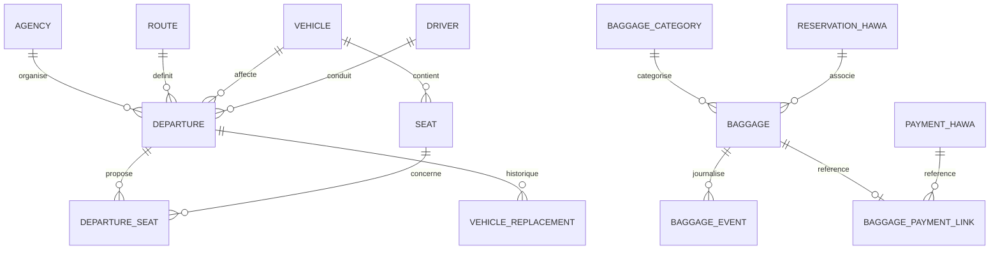

# Modèle conceptuel de données

```mermaid
erDiagram
  AGENCY ||--o{ DEPARTURE : organise
  ROUTE ||--o{ DEPARTURE : definit
  VEHICLE ||--o{ SEAT : contient
  VEHICLE ||--o{ DEPARTURE : affecte
  DRIVER ||--o{ DEPARTURE : conduit
  DEPARTURE ||--o{ DEPARTURE_SEAT : propose
  SEAT ||--o{ DEPARTURE_SEAT : concerne
  DEPARTURE ||--o{ VEHICLE_REPLACEMENT : historique
  BAGGAGE_CATEGORY ||--o{ BAGGAGE : categorise
  BAGGAGE ||--o{ BAGGAGE_EVENT : journalise
  BAGGAGE ||--o| BAGGAGE_PAYMENT_LINK : reference
  RESERVATION_HAWA ||--o{ BAGGAGE : associe
  PAYMENT_HAWA ||--o{ BAGGAGE_PAYMENT_LINK : reference
```

Les entités `RESERVATION_HAWA` et `PAYMENT_HAWA` sont **externes** à la contribution. Leur liaison définitive dépend des contrats du groupe.
